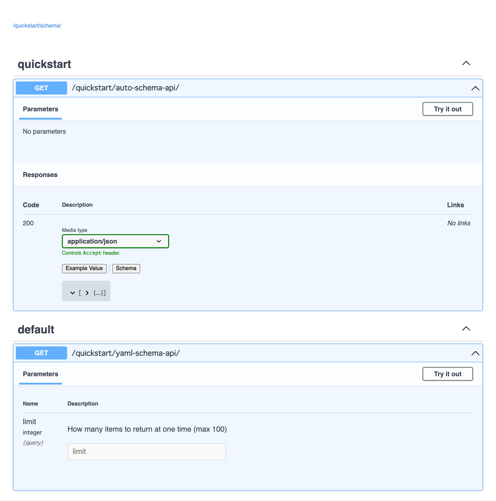

# sample app

Example project for `AutoYamlSchema`.

This project layout refer to https://www.django-rest-framework.org/tutorial/quickstart/

## setup

Create virtual environment with poetry

```bash
git clone git@github.com:shihono/drf-yaml-schema.git

cd drf-yaml-schema/
poetry install
poetry shell
```

In poetry environment, setup sample app

```bash
cd sample/

python manage.py runserver 
```

Starting server at http://127.0.0.1:8000/

Swagger UI at http://127.0.0.1:8000/quickstart/swagger/


